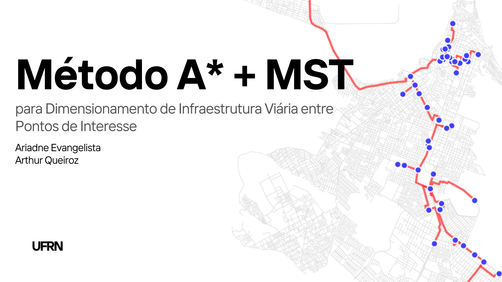
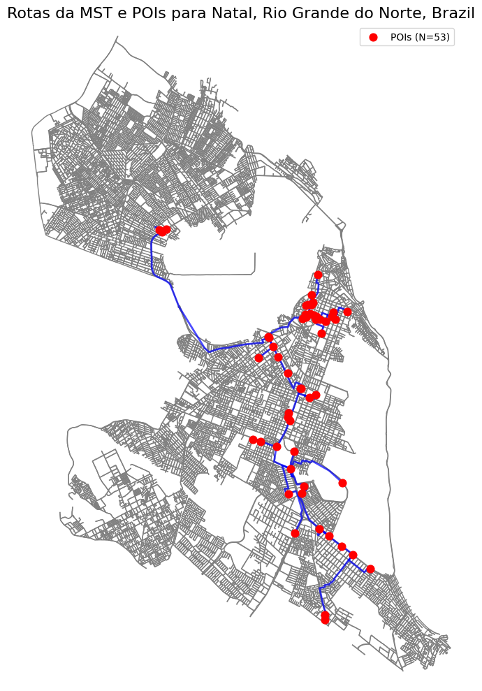
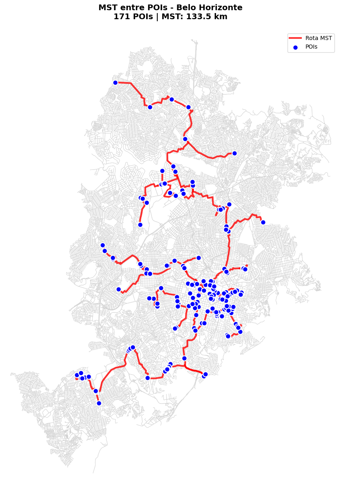
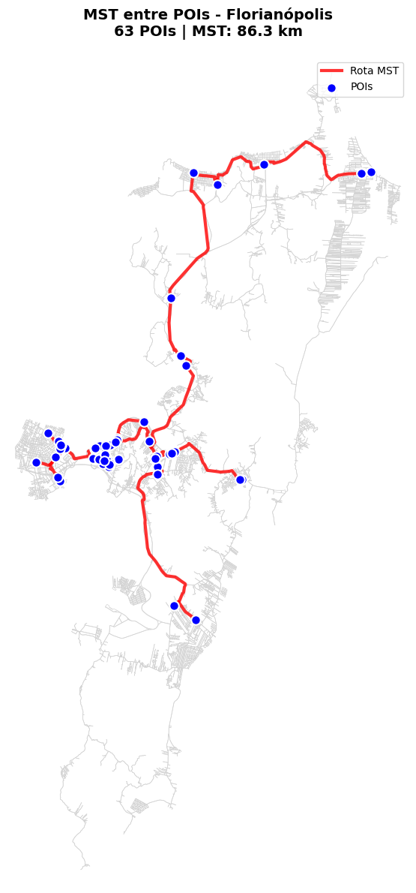
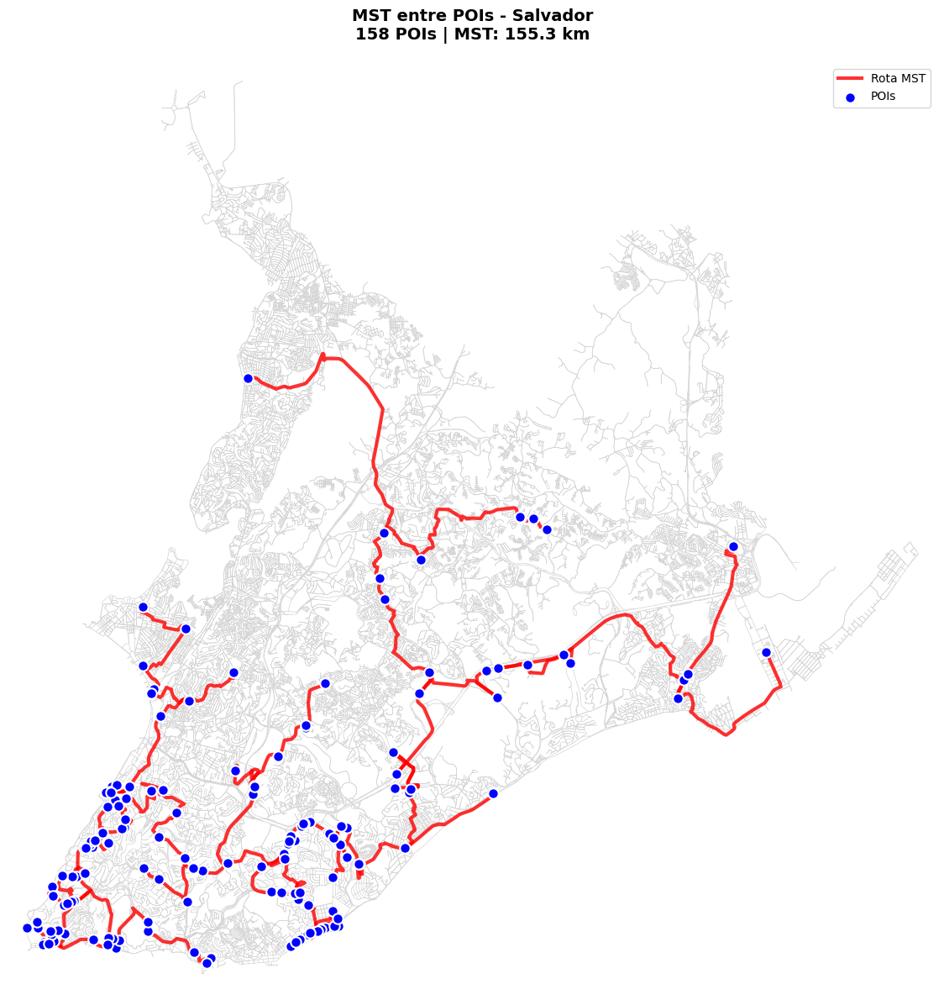
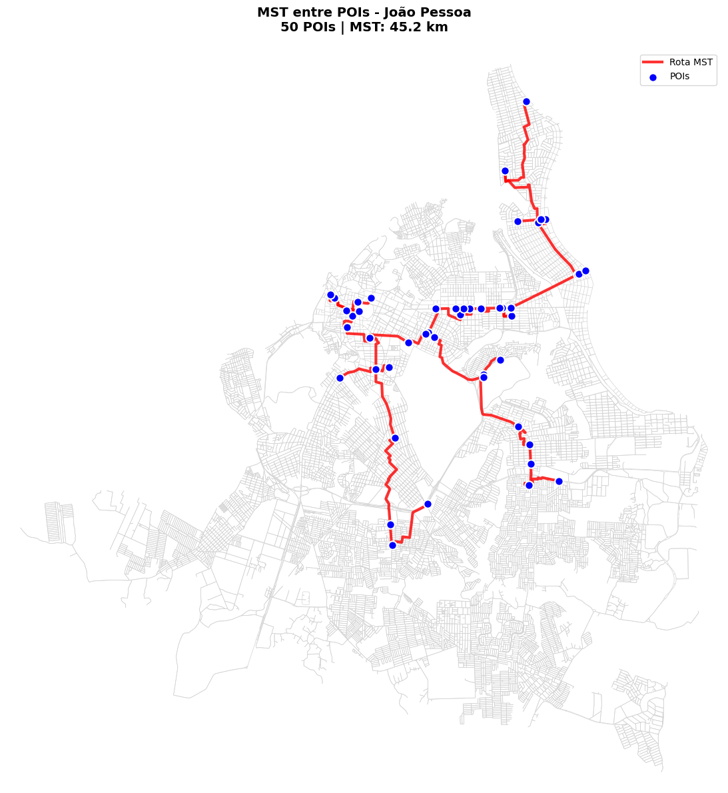
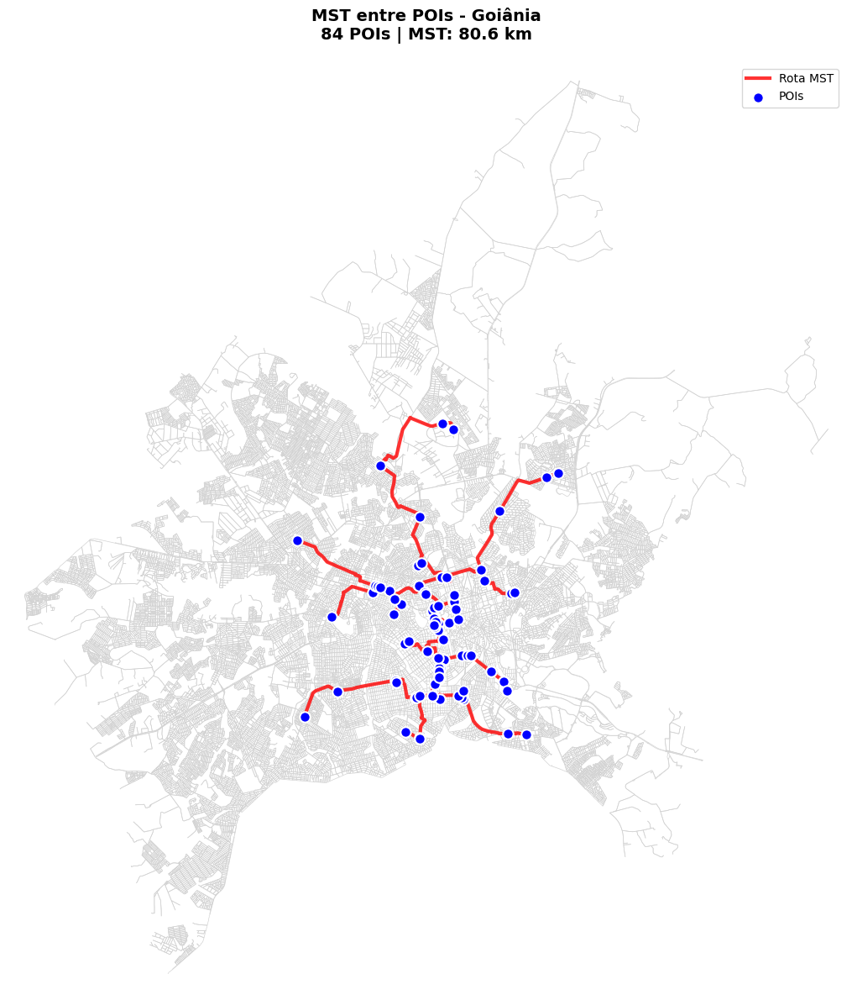
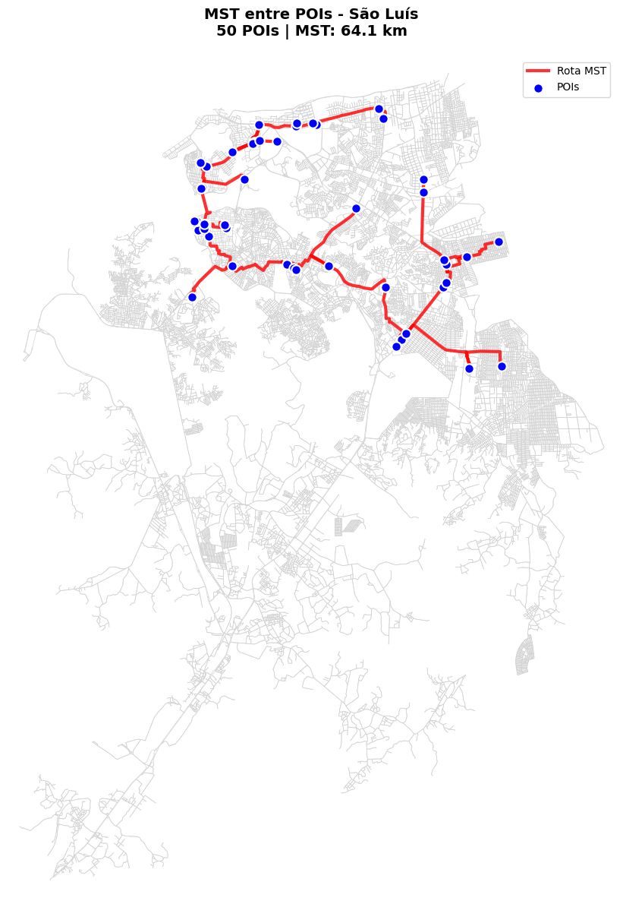
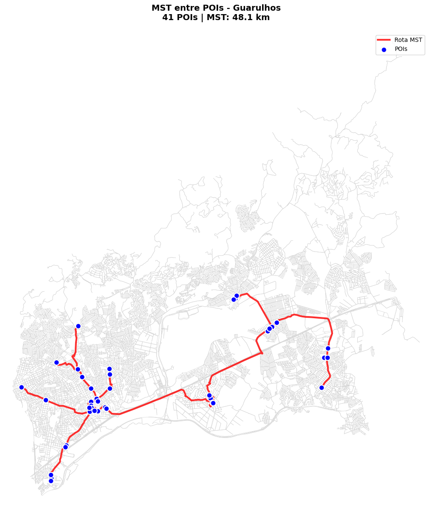

**O projeto foi desenvolvido por Ariadne Evangelista e Arthur Queiroz**  
**DCA3702 – Algoritmos e Estruturas de Dados II**

# Projeto 3: Método A* + MST para Dimensionamento de Infraestrutura Viária entre Pontos de Interesse
**Estudo de Caso em 8 Cidades**

<p align="center">
  <br>
</p>

---

## 1. Introdução

<p align = "justify">Este trabalho analisa a conectividade entre Pontos de Interesse (POIs) em cidades brasileiras, estimando a extensão mínima de vias necessária para interligá-los. Utilizamos uma metodologia que combina modelagem da rede viária com OSMnx e algoritmos de grafos: A* para caminhos mais curtos entre POIs e Kruskal para cálculo da Árvore Geradora Mínima (MST).</p>

<p align = "justify">O estudo foi realizado em oito cidades - Natal, Salvador, Belo Horizonte, Florianópolis, Goiânia, São Luís, Guarulhos e João Pessoa - utilizando estabelecimentos bancários como POIs. A abordagem envolve mapear POIs para nós da rede viária, calcular rotas ótimas com A*, construir um grafo completo com distâncias obtidas e aplicar Kruskal para encontrar a MST que conecta todos os pontos com custo mínimo.</p>

<p align = "justify">A análise comparativa dos resultados, incluindo comprimento total da MST e métricas de eficiência por POI, revela padrões de conectividade urbana influenciados por fatores geográficos e de planejamento. As visualizações das rotas da MST complementam a análise quantitativa, oferecendo insights sobre a infraestrutura necessária para conectar serviços essenciais em diferentes contextos urbanos.</p>

## 2. Metodologia

<p align = "justify">Neste estudo, os Pontos de Interesse (POIs) selecionados foram as agências bancárias (amenity: bank). A escolha se justifica pela ampla distribuição desses serviços em áreas urbanas e sua relevância para o cotidiano da população, exigindo boa conectividade territorial. Esta abordagem oferece uma perspectiva sobre a conectividade urbana centrada em serviços financeiros de acesso essencial.</p><p align = "justify">A seleção das oito cidades analisadas buscou representar a diversidade geográfica e urbanística brasileira, incluindo capitais regionais e cidades de médio porte com características distintas:</p>
Natal (RN): Capital nordestina com urbanização consolidada e influência litorânea

- **Salvador (BA):** Metrópole nordestina com topografia acidentada e grande extensão territorial

- **Belo Horizonte (MG):** Capital planejada em região montanhosa com malha viária radial

- **Florianópolis (SC):** Cidade insular com desafios de conectividade entre ilha e continente

- **Goiânia (GO):** Capital planejada do Centro-Oeste com traçado moderno

- **São Luís (MA):** Cidade histórica do Nordeste com desenvolvimento costeiro

- **Guarulhos (SP):** Município metropolitano com intensa conurbação na Grande São Paulo

- **João Pessoa (PB):** Capital nordestina de médio porte com desenvolvimento litorâneo

<p align = "justify">A metodologia consistiu em quatro etapas principais: primeiramente, a obtenção do grafo viário de cada cidade via OSMnx e sua projeção para sistema métrico; em seguida, o mapeamento dos POIs para os nós mais próximos na rede viária; posteriormente, o cálculo das rotas ótimas entre todos os pares de POIs usando o algoritmo A* com heurística euclidiana; e finalmente, a construção de um grafo completo com as distâncias obtidas e aplicação do algoritmo de Kruskal para encontrar a Árvore Geradora Mínima.</p><p align = "justify">A análise comparativa considerou o comprimento total da MST, a média de metros necessários por POI e por aresta da MST, permitindo avaliar a eficiência da conectividade em cada contexto urbano. As visualizações das rotas que compõem a MST em cada cidade complementam a análise quantitativa, revelando padrões espaciais de distribuição dos serviços bancários e da infraestrutura viária.</p>

## 3. Modelagem e Pré-processamento

<p align = "justify">A modelagem e pré-processamento dos dados foram realizados em quatro etapas principais, utilizando Python e bibliotecas especializadas em análise de redes urbanas. Na primeira etapa, foram importadas as bibliotecas essenciais: OSMnx para obtenção e manipulação de grafos viários, NetworkX para algoritmos de grafos, Matplotlib para visualização, Pandas para análise de dados e NumPy para cálculos numéricos. A supressão de avisos garantiu a limpeza do output durante a execução.</p>

```
# Bibliotecas 
import osmnx as ox
import networkx as nx
import matplotlib.pyplot as plt
import pandas as pd
import numpy as np
import warnings
```

<p align = "justify">Na segunda etapa, definiram-se os parâmetros do estudo, incluindo as oito cidades brasileiras selecionadas para análise e o tipo de ponto de interesse (POI) como estabelecimentos bancários (amenity: bank). Esta configuração inicial estabeleceu a base comparativa entre cidades com características urbanísticas distintas, desde metrópoles como Salvador e Belo Horizonte até cidades de médio porte como João Pessoa e Guarulhos.</p>

```
warnings.filterwarnings('ignore')

# Configurações iniciais - Parâmetro de POI e Cidades
cidades = [
    "Natal, Rio Grande do Norte, Brazil",
    "Belo Horizonte, Minas Gerais, Brazil",
    "Florianópolis, Santa Catarina, Brazil",
    "Salvador, Bahia, Brazil",
    "João Pessoa, Paraíba, Brazil",
    "Goiânia, Goiás, Brazil",
    "São Luís, Maranhão, Brazil",
    "Guarulhos, São Paulo, Brazil"
]
tipo_poi = {'amenity': 'bank'}

resultados_cidades = []
```

<p align = "justify">A terceira etapa consistiu na implementação de uma função auxiliar para conversão de grafos direcionados (MultiDiGraph) em grafos não direcionados (MultiGraph), preservando todos os atributos de nós e arestas. Esta conversão foi necessária para adequar a estrutura de dados aos algoritmos subsequentes, mantendo a integridade das informações da rede viária.</p>

```
# Função auxiliar
def to_undirected_multigraph(G):
    H = nx.MultiGraph()
    for n, data in G.nodes(data=True):
        H.add_node(n, **data)
    for u, v, data in G.edges(data=True):
        H.add_edge(u, v, **data)
    H.graph.update(G.graph)
    return H
```

<p align = "justify">A quarta e crucial etapa envolveu o desenvolvimento de uma função corrigida para mapeamento de POIs aos nós da rede viária. Diferentemente da abordagem convencional que processa listas completas de coordenadas, esta função processa cada POI individualmente, garantindo que cada ponto de interesse seja corretamente associado ao nó mais próximo no grafo. Esta correção foi fundamental para resolver o problema inicial de múltiplos POIs sendo atribuídos ao mesmo nó, assegurando a precisão do mapeamento espacial necessário para os cálculos subsequentes de conectividade.</p>

```
# Função CORRIGIDA para encontrar nós
def encontrar_nos_unicos(G, poi_points):
    """Encontra nós únicos para cada POI individualmente"""
    nos_unicos = set()

    for lat, lon in poi_points:
        try:
            # Processar CADA POI individualmente
            node = ox.distance.nearest_nodes(G, X=[lon], Y=[lat])[0]
            nos_unicos.add(node)
        except Exception as e:
            continue

    return list(nos_unicos)
```

## 4. Processamento e Cálculo da MST

<p align = "justify">O processamento das cidades seguiu um fluxo sequencial dividido em quatro etapas principais, conforme implementado no loop principal do código:</p>

```
for cidade in cidades:
    print(f"Processando: {cidade}")
```
**Primeira etapa - Obtenção e preparação dos grafos viários:** <p align = "justify"> Para cada cidade, obteve-se o grafo viário e realizou-se sua projeção métrica:</p>

```
G = ox.graph_from_place(cidade, network_type='drive')
G_proj = ox.project_graph(G)
G_undirected = to_undirected_multigraph(G_proj)
```
**Segunda etapa - Processamento dos POIs:** <p align = "justify"> Extraíram-se os Pontos de Interesse e mapearam-se para os nós da rede viária, incluindo tratamento para casos com poucos nós únicos:</p>

```
pois = ox.features.features_from_place(cidade, tags=tipo_poi)

if pois.empty:
    print(f"  - Nenhum POI encontrado")
    continue

poi_points = []
for idx, row in pois.iterrows():
    if row.geometry.geom_type == 'Point':
        poi_points.append((row.geometry.y, row.geometry.x))
    else:
        poi_points.append((row.geometry.centroid.y, row.geometry.centroid.x))

poi_nodes_unique = encontrar_nos_unicos(G_undirected, poi_points)

if len(poi_nodes_unique) < 2:
    print(f"  - POIs insuficientes: {len(poi_nodes_unique)} nós únicos")
    # Tentativa alternativa: usar grafo não projetado
    G_undirected_original = to_undirected_multigraph(G)
    poi_nodes_unique = encontrar_nos_unicos(G_undirected_original, poi_points)
    if len(poi_nodes_unique) < 2:
        continue
```
**Terceira etapa - Cálculo de rotas com A⋆ :**  <p align = "justify"> Implementou-se o algoritmo A* entre todos os pares de POIs com tratamento robusto de erros:</p>

```
G_completo = nx.Graph()
rotas_astar = {}
pares_calculados = 0

for i in range(len(poi_nodes_unique)):
    for j in range(i+1, len(poi_nodes_unique)):
        try:
            heuristic = lambda u, v: ox.distance.euclidean(
                G_proj.nodes[u]['y'], G_proj.nodes[u]['x'],
                G_proj.nodes[v]['y'], G_proj.nodes[v]['x']
            )
            rota = nx.astar_path(G_proj, poi_nodes_unique[i], poi_nodes_unique[j],
                               heuristic=heuristic, weight='length')
            distancia = nx.astar_path_length(G_proj, poi_nodes_unique[i], poi_nodes_unique[j],
                                           heuristic=heuristic, weight='length')
            G_completo.add_edge(poi_nodes_unique[i], poi_nodes_unique[j], weight=distancia)
            rotas_astar[(poi_nodes_unique[i], poi_nodes_unique[j])] = rota
            pares_calculados += 1
        except (nx.NetworkXNoPath, KeyError, nx.NodeNotFound):
            continue

if G_completo.number_of_edges() == 0:
    print(f"  - Nenhuma rota válida encontrada")
    continue
```

**Quarta etapa - Cálculo da MST e métricas:** <p align = "justify"> Aplicou-se o algoritmo de Kruskal, calculou-se o comprimento real e armazenaram-se os resultados:</p>

```
mst_arestas = list(nx.minimum_spanning_edges(G_completo, data=True, algorithm='kruskal'))
comprimento_mst = sum([d['weight'] for (u, v, d) in mst_arestas])

comprimento_real = 0
rotas_mst = []

for u, v, d in mst_arestas:
    if (u, v) in rotas_astar:
        rota = rotas_astar[(u, v)]
        rotas_mst.append(rota)
        for k in range(len(rota)-1):
            arestas = G_proj.get_edge_data(rota[k], rota[k+1])
            if arestas:
                for key in arestas:
                    if 'length' in arestas[key]:
                        comprimento_real += arestas[key]['length']

media_por_poi = comprimento_real / len(poi_nodes_unique) if poi_nodes_unique else 0
media_por_aresta = comprimento_real / len(mst_arestas) if mst_arestas else 0

resultados_cidades.append({
    'Cidade': cidade,
    'POIs_Encontrados': len(poi_points),
    'POIs_Unicos': len(poi_nodes_unique),
    'MST_km': comprimento_mst / 1000,
    'MST_Real_km': comprimento_real / 1000,
    'Media_por_POI_km': media_por_poi / 1000,
    'Media_por_Aresta_km': media_por_aresta / 1000,
    'Arestas_MST': len(mst_arestas),
    'Rotas_MST': rotas_mst,
    'Grafo': G_proj,
    'Nos_POIs': poi_nodes_unique
})
```
**Tratamento de erros:** <p align = "justify"> Todo o processamento foi encapsulado em blocos `try-except` para garantir a continuidade do processamento mesmo em caso de falhas individuais:</p>

```
except Exception as e:
    print(f"  - Erro: {e}")
    continue
    
```
## 5. Resultado: Comparação entre Cidades

<p align = "justify">Após o processamento individual de cada cidade, realizou-se a análise comparativa dos resultados obtidos, conforme implementado no código:</p>

```
if resultados_cidades:
    df_resultados = pd.DataFrame(resultados_cidades)

```

**Construção da tabela comparativa:** <p align = "justify"> Os resultados armazenados foram consolidados em um DataFrame do Pandas para facilitar a análise:</p>

```
print("\n" + "_"*80)
print("COMPARAÇÃO ENTRE CIDADES")
print("_"*80)

print("\nTABELA COMPARATIVA:")
comparacao = df_resultados[['Cidade', 'POIs_Unicos', 'MST_Real_km', 'Media_por_POI_km', 'Media_por_Aresta_km']].round(2)
print(comparacao.to_string(index=False))
```

**Cálculo das estatísticas consolidadas:** <p align = "justify"> Foram computadas as métricas gerais de tendência central e dispersão para toda a amostra de cidades:</p>

```
print(f"\nESTATÍSTICAS GERAIS:")
print(f"Comprimento médio da MST: {df_resultados['MST_Real_km'].mean():.2f} km")
print(f"Desvio padrão da MST: {df_resultados['MST_Real_km'].std():.2f} km")
print(f"Média por POI: {df_resultados['Media_por_POI_km'].mean():.2f} km/POI")
print(f"Desvio padrão por POI: {df_resultados['Media_por_POI_km'].std():.2f} km/POI")
print(f"Média por aresta MST: {df_resultados['Media_por_Aresta_km'].mean():.2f} km/aresta")
print(f"Desvio padrão por aresta: {df_resultados['Media_por_Aresta_km'].std():.2f} km/aresta")

```
**Identificação dos extremos:** <p align = "justify"> Foram destacadas as cidades com os valores mais altos e mais baixos de comprimento da MST:</p>

```
if len(df_resultados) > 0:
    maior_mst = df_resultados.loc[df_resultados['MST_Real_km'].idxmax()]
    menor_mst = df_resultados.loc[df_resultados['MST_Real_km'].idxmin()]

    print(f"\nEXTREMOS:")
    print(f"Maior MST: {maior_mst['Cidade']} ({maior_mst['MST_Real_km']:.2f} km)")
    print(f"Menor MST: {menor_mst['Cidade']} ({menor_mst['MST_Real_km']:.2f} km)")
```
<p align = "justify">Esta etapa permitiu a comparação entre as oito cidades processadas, destacando padrões de eficiência na conectividade dos serviços bancários e fornecendo informações sobre a influência de fatores urbanísticos e geográficos na infraestrutura necessária para interligação dos POIs.</p>

## 6. Resultados e Análise Comparativa

### 6.1. Resultados por Cidade

A Tabela 1 apresenta os resultados completos obtidos para as oito cidades analisadas, ordenados por comprimento da MST em ordem decrescente.

**Tabela 1:** Resultados completos da MST por cidade
| Cidade | POIs Total | POIs Únicos | MST (km) | Média por POI (km) | Média por Aresta (km) | Arestas MST |
|--------|------------|-------------|----------|-------------------|----------------------|-------------|
| Salvador | 185 | 158 | 155,25 | 0,98 | 0,99 | 157 |
| Belo Horizonte | 205 | 171 | 133,49 | 0,78 | 0,79 | 170 |
| Florianópolis | 73 | 63 | 86,33 | 1,37 | 1,39 | 62 |
| Goiânia | 96 | 84 | 80,60 | 0,96 | 0,97 | 83 |
| São Luís | 51 | 50 | 64,13 | 1,28 | 1,31 | 49 |
| Guarulhos | 47 | 41 | 48,12 | 1,17 | 1,20 | 40 |
| João Pessoa | 53 | 50 | 45,20 | 0,90 | 0,92 | 49 |
| Natal | 61 | 53 | 43,05 | 0,81 | 0,83 | 52 |

### 6.2. Análise Estatística

A Tabela 2 sumariza as estatísticas descritivas das principais métricas de conectividade analisadas.

**Tabela 2:** Estatísticas descritivas das métricas de conectividade
| Métrica | Média | Desvio Padrão | Mínimo | Máximo |
|---------|-------|---------------|--------|--------|
| Comprimento Total da MST | 82,02 km | 42,05 km | 43,05 km | 155,25 km |
| Média por POI | 1,03 km/POI | 0,22 km/POI | 0,78 km/POI | 1,37 km/POI |
| Média por Aresta MST | 1,05 km/aresta | 0,22 km/aresta | 0,79 km/aresta | 1,39 km/aresta |
| POIs Únicos por Cidade | 83,75 | 51,56 | 41,00 | 171,00 |
| Arestas MST por Cidade | 82,75 | 51,56 | 40,00 | 170,00 |


### 6.3. Destaques e Extremos

<p align="center">
  <br>
</p>

**Principais achados:**
- **Maior demanda de infraestrutura**: Salvador (155,25 km)
- **Menor demanda de infraestrutura**: Natal (43,05 km)  
- **Conectividade mais eficiente**: Belo Horizonte (0,78 km/POI)
- **Conectividade menos eficiente**: Florianópolis (1,37 km/POI)

<p align = "justify">Existe uma relação diretamente proporcional entre o número de Pontos de Interesse (POIs) e o comprimento da MST. Conforme aumenta a quantidade de POIs únicos na cidade, o comprimento total da Árvore Geradora Mínima também cresce, seguindo uma tendência linear ascendente. Essa correlação era esperada, pois uma rede com mais pontos normalmente exigirá mais conexões para interligar todos os nós, resultando em uma árvore de maior extensão. No entanto, o gráfico também revela que nem todas as cidades seguem rigidamente essa tendência, alguns pontos se afastam da linha de tendência, sugerindo que fatores como a disposição geográfica dos POIs e as características do terreno influenciam significativamente o comprimento final da MST. Algumas cidades apresentam um comprimento de MST maior do que o esperado para sua quantidade de POIs, indicando que seus pontos estão mais dispersos territorialmente. Por outro lado, cidades com MST mais curta em relação ao número de POIs sugerem uma distribuição mais concentrada ou compacta dos pontos de interesse.</p>

### 6.4. Visualização dos Resultados

<p align = "justify">Para complementar a análise quantitativa, implementou-se rotina de visualização que sobrepõe as rotas da MST (vermelho) e POIs (azul) ao grafo viário base (cinza), gerando mapas individuais para cada cidade com resolução adequada para análise espacial. As visualizações permitem a identificação de padrões de distribuição espacial e conectividade viária específicos de cada contexto urbano.</p>


#### Natal

<p align="center">
  <br>
</p>

#### Belo Horizonte

<p align="center">
  <br>
</p>

#### Florianópolis

<p align="center">
  <br>
</p>

#### Salvador

<p align="center">
  <br>
</p>

#### João Pessoa

<p align="center">
  <br>
</p>

#### Goiânia

<p align="center">
  <br>
</p>

#### São Luís

<p align="center">
  <br>
</p>

#### Guarulhos

<p align="center">
  <br>
</p>

## 7. Conclusão

<p align = "justify">Com base na análise realizada, a aplicação conjunta dos algoritmos A* e da Árvore Geradora Mínima (MST) proporcionou uma avaliação abrangente da eficiência de conectividade entre os Pontos de Interesse (POIs) nas cidades estudadas. Enquanto a MST quantifica a infraestrutura mínima necessária para interligar todos os pontos, o A* permite estimar a eficiência das rotas específicas entre pares de POIs, considerando as restrições reais da malha urbana.</p>

<p align = "justify">Os resultados evidenciam padrões distintos. Florianópolis e Goiás, com valores reduzidos de MST por POI (0,2 km), indicam uma distribuição espacial compacta e sugerem rotas A* curtas e diretas, refletindo uma estrutura urbana altamente eficiente. Em contraste, São Luís e Guarulhos apresentam os maiores índices (1,3 km e 1,1 km por POI, respectivamente), o que aponta para rotas A* mais extensas e complexas, revelando desafios de conectividade que impactam tanto o planejamento estratégico quanto a mobilidade cotidiana.</p>

<p align = "justify">A relação entre o comprimento da MST e o número de POIs varia significativamente entre os municípios. Salvador, por exemplo, possui uma MST extensa (152,8 km), o que implica em rotas A* igualmente longas para conectar POIs dispersos, característica de uma mancha urbana ampla. Por outro lado, Natal e João Pessoa, com MSTs mais curtas, sugerem trajetos A* naturalmente mais eficientes e concentrados.</p>

<p align = "justify">Essa abordagem integrada demonstra o valor da combinação entre MST e A*: enquanto a MST orienta decisões estratégicas sobre infraestrutura urbana, o A contribui para a otimização operacional das rotas. Juntas, essas ferramentas oferecem uma visão robusta e complementar da acessibilidade urbana, essencial para o planejamento inteligente de cidades.</p>

## 8. Adicionais

**Link Vídeo:**

**Link Colab:** https://colab.research.google.com/drive/1sIa7lMoN9G2mhbtA4oBhVpHOBf5bmYoo?usp=sharing


